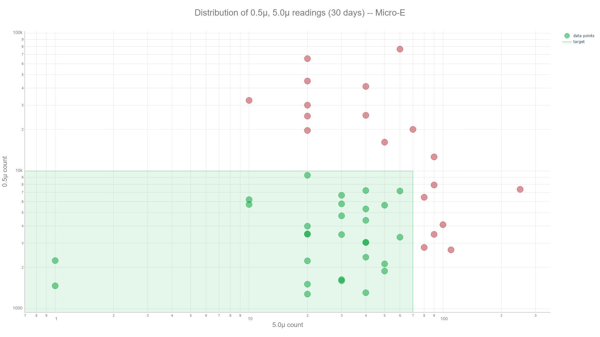
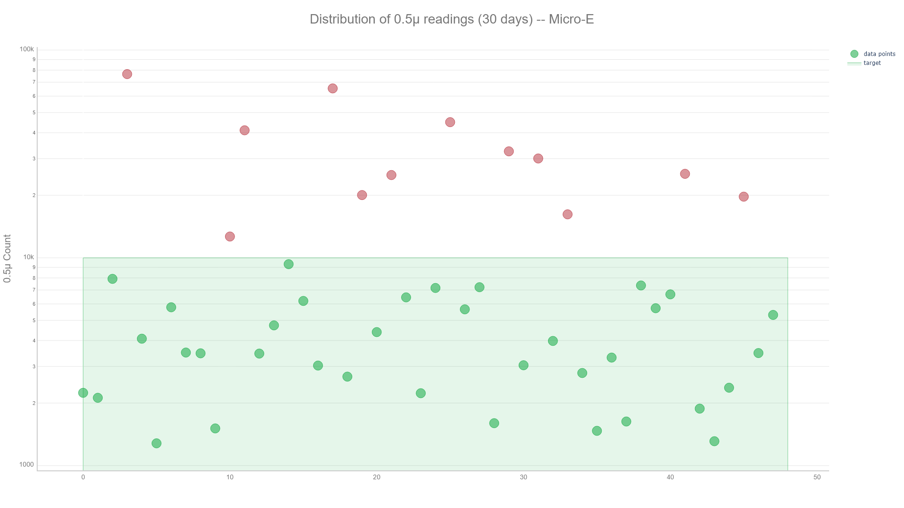
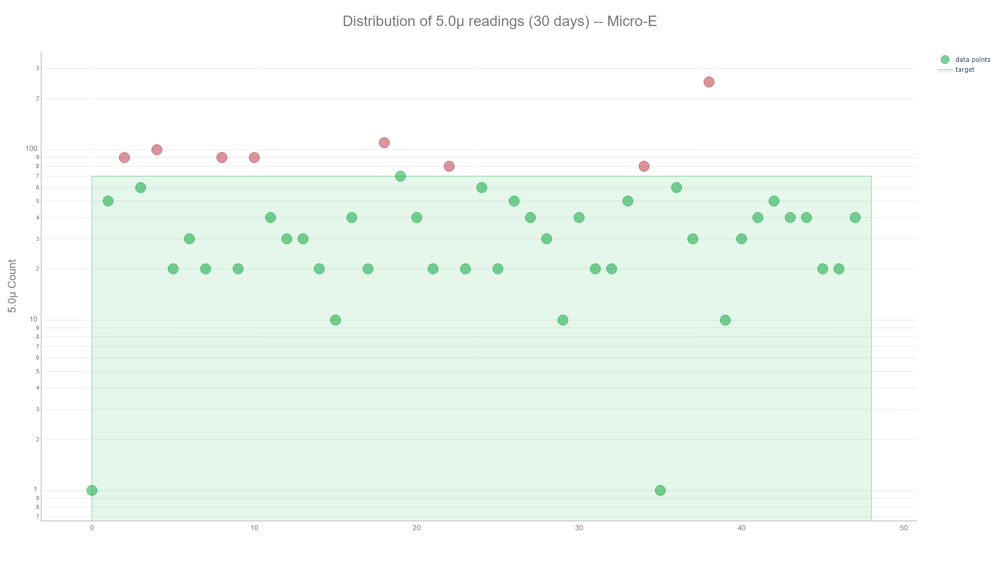

## Table of Contents

- [About the Project](#about-the-project)
- [Running the Script](#running-the-script)
- [Excel Setup](#minimum-excel-setup)
- [Examples](#example-output)
</br></br>

# About the project
TODO
</br>

# Running the Script

Creating the venv and install packages only required on initial setup/run.  
**virtual environment will still need to be activated each time before running*

Create a virtual environment and activate it (optional):
```sh
$ python -m venv venv
$ venv/Scripts/activate
```
Install the required packages (required):
```sh
$ pip install -r requirements.txt
```
Run the main file:
```sh
$ python main.py
```
</br>

# Minimum Excel Setup

| DATE       | TIME     | 0.5 MICRONS | 5.0 MICRONS |
| :--        | :--      |     :--:    |     :--:    |
| 3/16/21    | 11:00 AM |     4354    |      54     |
| 3/16/21    | 11:00 AM |     1823    |      48     |
| 3/16/21    | 3:00 PM  |     3544    |      63     |

</br>

>DATE (excel format: Date): Date of measurement  
>TIME (excel format: Time): Time of measurement  
>LOCATION (excel format: General): Place of measurement within area  
>0.5 MICRONS (excel format: General): Recorded Measurement  
>5.0 MICRONS (excel format: General): Recorded Measurement  
> **column headers must be exact and are case sensitive*  
> **Tab names will be pulled and used to designate functional area, name them accordingly.*

</br>

# Example Output

### Combo Chart

</br></br>

### Single Charts


